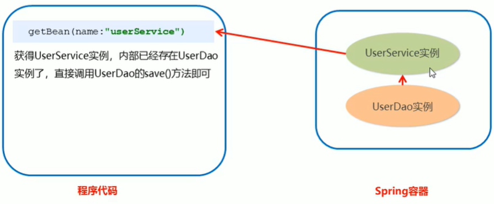

# 3. Spring 配置文件

## Bean标签基本配置

用于配置对象交由**Spring**来创建。

默认情况下它调用的是类中的**无参构造方法**，如果没有无参构造方法则不能创建成功。

基本属性：

* `id`：Bean实例在Spring容器中的唯一标识
* `class`：Bean的全限定名称

## Bean标签范围配置

* `scope`：指定对象的作用范围，取值如下：

|    取值范围    | 说明                                                         |
| :------------: | ------------------------------------------------------------ |
| **singleton**  | 默认值，单例的                                               |
| **prototype**  | 多例的                                                       |
|    request     | Web项目中，Spring创建一个Bean对象，将对象存到`request`作用域中 |
|    session     | Web项目中，Spring创建一个Bean对象，将对象存到`session`作用域中 |
| global session | Web项目中，应用在Portlet环境，如果没有Portlet环境那么`globalSession`相当于`session` |

当`scope`的取值是 `singleton`时：

Bean的实例化个数：1个

Bean的实例化时机：当Spring核心配置文件被加载时，实例化配置的Bean实例

Bean的生命周期：

* 对象创建：当应用加载，创建容器时，对象就被创建了
* 对象运行：只要容器在，对象一直活着
* 对象销毁：当应用卸载，容器销毁时，对象销毁

---

当`scope`的取值是 `prototype`时：

Bean的实例化个数：多个

Bean的实例化时机：当调用getBean()方法时，实例化配置的Bean

Bean的生命周期：

* 对象创建：当使用对象时，创建新的对象
* 对象运行：只要对象在使用中，对象一直活着
* 对象销毁：当对象长时间不使用了，被Java的垃圾回收器回收

## Bean生命周期配置

* `init-method`：指定类中的初始化方法名称
* `destroy-method`：指定类中销毁方法名称

##  Bean实例化的三种方式

* 无参**构造**方法实例化（常用，重点）

  ```xml
  <!--1. 通过无参构造方法创建对象-->
  <bean id="userDao" class="com.bright.dao.impl.UserDaoImpl" init-method="init" destroy-method="destroy"/>
  ```

* 工厂**静态**方法实例化

  ```xml
  <!--2. 通过工厂静态方法创建对象-->
  <bean id="userDao" class="com.bright.factory.StaticFactory" factory-method="getUserDao"/>
  ```

* 工厂**实例**方法实例化

  ```xml
  <!--3. 通过工厂实例获取对象 -->
  <bean id="factory" class="com.bright.factory.DynamicFactory"/>
  <bean id="userDao" factory-bean="factory" factory-method="getUserDao"/>
  ```

## Bean的依赖注入分析

目前UserService实例和UserDao实例都存在与Spring容器中，当前的做法是在容器外部获得UserService实例和UserDao实例，然后在程序中进行结合。


因为UserService和UserDao都在Spring容器中，而最终程序直接使用的是UserService，所以可以在Spring容器中，将UserDao设置到UserService内部。



## Bean的依赖注入方式

依赖注入（**Dependency Injection**）：它是Spring框架核心IoC的具体实现。

在编写程序时，通过控制反转，把对象的创建交给了Spring，但是代码中不可能出现没有依赖的情况。IoC解耦只是降低它们的依赖关系，但不会消除。例如：业务层依然会调用持久层的方法。

那这种业务层和持久层的依赖关系，在使用Spring之后，就让Spring来维护了。简单地说，就是坐等框架把持久层对象传入业务层，而不用我们自己去获取。

> 怎么将UserDao注入到UserService内部呢？

* **构造方法** 

* **set方法** 

  ```xml
  <!--通过set方法依赖注入-->
  <bean id="userService" class="com.bright.service.impl.UserServiceImpl">
      <property name="userDao" ref="userDao"/> <!--userDao 对应于 setUserDao()-->
  </bean>
  ```

**1）set方法注入**

`P命名空间`注入本质也是set方法注入，但比起上述的set方法注入更加方便，主要体现在配置文件中，如下：

首先，需要引入P命名空间：

```xml
xmlns:p="http://www.springframework.org/schema/p"
```

其次，需要修改注入方式

```xml
<!--通过set方法依赖注入-->
<bean id="userService" class="com.bright.service.impl.UserServiceImpl" p:userDao-ref="userDao"/>
```

可以代替子标签`property` 。

**2）构造方法注入**

```xml
<!--通过构造方法注入-->
<bean id="userService" class="com.bright.service.impl.UserServiceImpl">
    <constructor-arg name="userDao" ref="userDao"/>
</bean>
```

## Bean的依赖注入的数据类型

上面的操作，都是注入的引用Bean，除了对象的引用可以注入，普通数据类型、集合等都可以在容器中进行注入。

注入的三种数据类型：

* 普通数据类型（`value`）

  ```xml
  <!--基本类型注入-->
  <bean id="userDao" class="com.bright.dao.impl.UserDaoImpl">
      <property name="username" value="张山"/>
      <property name="age" value="18"/>
  </bean>
  ```

* 引用数据类型（`ref`）见上面的`set`注入

* 集合数据类型

  ```xml
  <!--集合类型注入-->
  <bean id="userDao" class="com.bright.dao.impl.UserDaoImpl">
      <property name="username" value="张山"/>
      <property name="age" value="18"/>
      <property name="strList">
          <list>
              <value>aaa</value>
              <value>bbb</value>
              <value>ccc</value>
          </list>
      </property>
      <property name="userMap">
          <map>
              <entry key="user1" value-ref="user01"/>
              <entry key="user2" value-ref="user02"/>
          </map>
      </property>
      <property name="properties">
          <props>
              <prop key="p1">ppt01</prop>
              <prop key="p2">ppt02</prop>
              <prop key="p3">ppt03</prop>
          </props>
      </property>
  </bean>
  
  <bean id="user01" class="com.bright.domain.User">
      <property name="name" value="张山"/>
      <property name="addr" value="北京"/>
  </bean>
  
  <bean id="user02" class="com.bright.domain.User">
      <property name="name" value="李斯"/>
      <property name="addr" value="天津"/>
  </bean>
  ```

## 引入其他配置文件（分模块开发）

实际开发中，Spring的配置内容非常多，这就导致Spring配置很繁杂且体积很大，所以，可以将部分配置拆解到其他配置文件中，而在Spring主配置文件通过import标签进行加载。

```xml
<!-- 引入其他配置文件(分模块开发) -->
<import resource="applicationContext-user.xml"/>
```

## 知识要点

### Spring的重点配置

`<bean>`标签：

* id属性：在容器中Bean实例的唯一标识，不允许重复
* class属性：要实例化的Bean的全限定名
* scope属性：Bean的作用范围，常用是`singleton`（默认）和`prototype` 
* `<property`标签：属性注入（`set`方法）
  * name属性：属性名称
  * value属性：注入的普通属性值
  * ref属性：注入到对象引用值
  * `<list>`标签
  * `<map>`标签
  * `<properties>`标签
* `<constructor-arg>`标签（构造方法注入）

`<import>`标签：导入其他的`Spring`的分文件


