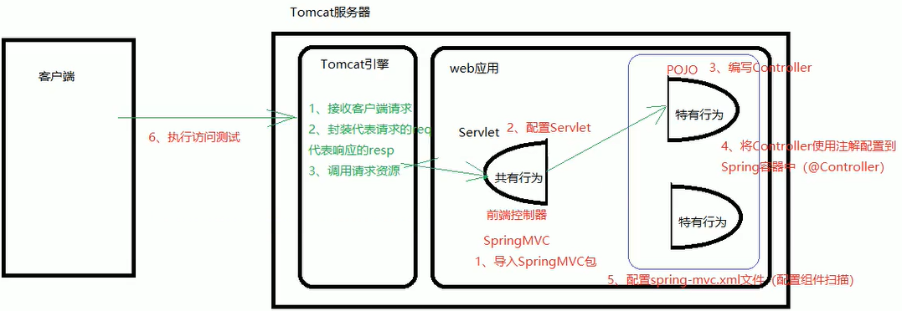
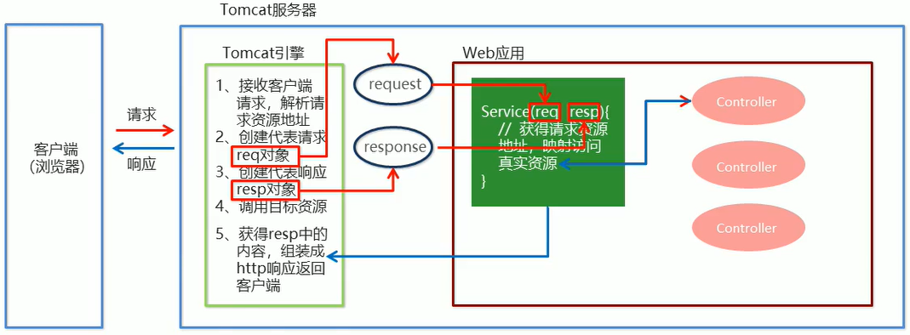

# SpringMVC简介

## SpringMVC概述

**SpringMVC**是一种基于Java的实现MVC设计模型的请求驱动类型的轻量级Web框架，属于**SpringFrameWork**的后续产品，已经融合在Spring Web Flow中。

SpringMVC已经成为目前最主流的MVC框架之一，并且随着Spring3.0的发布，全面超越Struts2，成为最优秀的MVC框架。它通过一套注解，让一个简单的Java类成为处理请求的控制器，而无须实现任何接口。同时它还支持**RESTful**编程风格的请求。



## SpringMVC快速入门

需求：客户端发起请求，服务端接收请求，执行逻辑并进行视图跳转。

开发步骤：

① 导入SpringMVC相关坐标

```xml
<dependency>
    <groupId>org.springframework</groupId>
    <artifactId>spring-webmvc</artifactId>
    <version>5.2.9.RELEASE</version>
</dependency>
```

② 配置SpringMVC核心控制器DispathcerServlet

```xml
<!--配置SpringMVC的前端控制器-->
<servlet>
    <servlet-name>DispatcherServlet</servlet-name>
    <servlet-class>org.springframework.web.servlet.DispatcherServlet</servlet-class>
    <init-param>
        <param-name>contextConfigLocation</param-name>
        <param-value>classpath:spring-mvc.xml</param-value>
    </init-param>
    <load-on-startup>1</load-on-startup> <!--服务器启动时，加载配置-->
</servlet>

<servlet-mapping>
    <servlet-name>DispatcherServlet</servlet-name>
    <url-pattern>/</url-pattern>
</servlet-mapping>
```

③ 创建Controller类和视图页面

```java
@Controller
public class UserController {

    @RequestMapping("/quick")
    public String save() {
        System.out.println("Controller save is running...");
        return "success.jsp";
    }
}
```

④ 使用注解配置Controller类中的业务方法的映射地址

```java
@RequestMapping("/quick")
```

⑤ 配置SpringMVC核心文件spring-mvc.xml

```xml
<!--Controller的组件扫描-->
<context:component-scan base-package="com.bright.controller"/>
```

⑥ 客户端发起请求测试

## SpringMVC流程示意图



