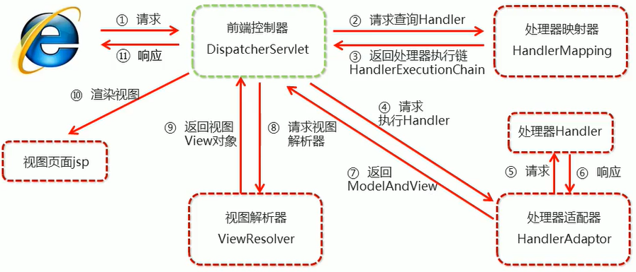

# SpringMVC 组件解析

## SpringMVC 的执行流程



① 用户发送请求至前端控制器DispatcherServlet。

② DispatcherServlet收到请求调用HandlerMapping处理器映射器。

③ 处理器映射器找到具体的处理器（可以根据xml配置、注解进行查找），生成处理器对象及处理器拦截器（如果有则成功）一并返回给DispatcherServlet。

④ DispatcherServlet调用HandlerAdapter处理器适配器。

⑤ HandlerAdapter经过适配调用具体的处理器（Controller，也叫后端控制器）。

⑥ Controller执行完成返回ModelAndView。

⑦ HandlerAdapter将Controller执行返回的结果ModelAndView返回给DispatcherServlet。

⑧ DispatcherServlet将ModelAndView传给ViewReslover视图解析器。

⑨ ViewReslover解析后返回具体的View。

⑩ DispatcherServlet根据View进行渲染视图（即将模型数据填充至视图中）。DispatcherServlet响应用户。

## SpringMVC注解解析

**@ResquestMapping**

作用：用于建立请求URL和处理请求方法之间的对应关系。

位置：

* 类上，请求URL的第一级访问目录。此处不写的话，就相当于应用的根目录
* 方法上，请求URL的第二级访问目录，与类上的使用@ReqquestMapping标注的一级目录一起组成访问虚拟路径

属性：

* **value**：用于指定请求的URL。它和path属性的作用是一样的。
* **method**：用于指定请求的方式。`Request.GET`、`Request.POST`等。
* **params**：用于指定限制请求参数的条件。它支持简单的表达式。要求请求参数的key和value必须和配置的一模一样。

例如：

* **params = {"accountName"}**，表示请求参数必须有accountName
* **params = {"money!100"}**，表示请求参数中money不能是100

## SpringMVC注解解析

**1. mvc命名空间引入**

命名空间：

```xml
xmlns:context="http://www.springframework.org/schema/context"
xmlns:mvc="http://www.springframework.org/schema/mvc"
```

约束地址：

```xml
http://www.springframework.org/schema/context http://www.springframework.org/schema/context/spring-context.xsd
http://www.springframework.org/schema/mvc http://www.springframework.org/schema/mvc/spring-mvc.xsd
```

**2. 组件扫描**

SpringMVC基于spring容器，所以在进行springMVC操作时，需要将controller存储到spring容器中，如果使用 `@Controller` 注解标注的话，就需要使用 `<context:component-scan base-package="com.bright.controller"/>` 进行组件扫描。

## SpringMVC 的XML配置解析

**1. 视图解析器**

SpringMVC有默认组件配置，默认组件都是`DispatcherServlet.properties` 配置文件中配置的，该配置文件地址`org/springframework/web/servlet/DispatcherServlet.properties`，该文件中配置了默认的视图解析器，如下：

```properties
org.springframework.web.servlet.ViewResolver=org.springframework.web.servlet.view.InternalResourceViewResolver
```

翻看该解析器源码，可以看到该解析器的默认配置，如下：

```java
REDIRECT_URL_PREFIX = "redirect:";  // 重定向前缀
FORWARD_URL_PREFIX = "forward:";    // 转发前缀 （默认值）

prefix = "";  // 视图名称前缀
suffix = "";  // 视图名称后缀
```

```xml
<!--配置内部资源视图解析器-->
<bean id="viewResolver" class="org.springframework.web.servlet.view.InternalResourceViewResolver">
    <!--前缀-->
    <property name="prefix" value="/jsp/"/>
    <!--后缀-->
    <property name="suffix" value=".jsp"/>
</bean>
```

## 知识要点

**SpringMVC的相关组件**

* 前端控制器：DispatcherServlet
* 处理器映射器：HandlerMapping
* 处理器适配器：HandlerAdapter
* 处理器：Handler
* 视图解析器：ViewResolver
* 视图：View

**SpringMVC的注解和配置**

* 请求映射注解：`@RequestMapping` 

* 视图解析器配置：

  ```java
  REDIRECT_URL_PREFIX = "redirect:";  // 重定向前缀
  FORWARD_URL_PREFIX = "forward:";    // 转发前缀 （默认值）
  
  prefix = "";  // 视图名称前缀
  suffix = "";  // 视图名称后缀
  ```

  


