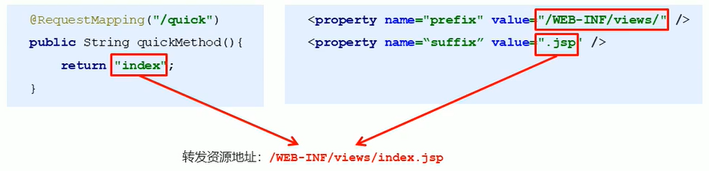

# SpringMVC 的数据响应

## SpringMVC 数据响应的方式

1. 页面跳转
   * 直接字符串
   * 通过 `ModelAndView` 对象返回

2. 回写数据
   * 直接返回字符串
   * 返回对象或集合

## 页面跳转

### 返回字符串形式

直接返回字符串:此种方式会将返回的字符串与视图解析器的前后缀拼接后跳转。



返回带有前缀的字符串：

转发：`forward:/WEB-INF/views/index.jsp` 

重定向：`redirect:/index.jsp` 

### 返回ModelAndView对象

```java
// @RequestMapping(value = "/quick", method = RequestMethod.GET, params = {"username"})
@RequestMapping(value = "/quick")
public String save() {
    System.out.println("Controller save is running...");
    return "success";
}

@RequestMapping("/quick2")
public ModelAndView save2() {
    /*
      Model: 模型  封装数据
      View: 视图   展示数据
     */
    ModelAndView modelAndView = new ModelAndView();
    modelAndView.addObject("username", "Bright Xu");
    // 设置视图名称
    modelAndView.setViewName("success");
    return modelAndView;
}

@RequestMapping("/quick3")
public ModelAndView save3(ModelAndView modelAndView) {
    modelAndView.addObject("username", "Tom");
    modelAndView.setViewName("success");
    return modelAndView;
}

@RequestMapping("/quick4")
public String save4(Model model) {
    model.addAttribute("username", "Jerry");
    return "success";
}

@RequestMapping("/quick5")
public String save5(HttpServletRequest request) {
    request.setAttribute("username", "Maria");
    return "success";
}
```

## 回写数据

### 直接返回字符串

Web基础阶段，客户端访问服务器端，如果想直接回写字符串作为响应体返回的话，只需要使用response.getWriter().print("hello world")即可，那么在Controller中想直接回写字符串该怎样呢?

① 通过SpringMVC框架注入的response对象，使用response.getWriter().print("hello world")回写数据，此时不需要视图跳转，业务方法返回值为void。

```java
@RequestMapping("/quick6")
public void save6(HttpServletResponse response) throws IOException {
    response.getWriter().write("{\"username\": \"Kangkang\"}");
}
```

② 将需要回写的字符串直接返回，但此时需要通过`@ResponseBody`注解告知SpringMVC框架，方法返回的字符串不是跳转是直接在http响应体中返回。

```java
@RequestMapping("/quick7")
@ResponseBody
public String save7() {
    return "{\"username\": \"Kangkang\"}";
}
```

#### 返回对象或集合

返回JSON字符串

```xml
<dependency>
    <groupId>com.fasterxml.jackson.core</groupId>
    <artifactId>jackson-databind</artifactId>
    <version>2.11.2</version>
</dependency>
```

**方式一**

```java
@RequestMapping("/quick9")
@ResponseBody
public String save9() throws JsonProcessingException {
    User user = new User();
    user.setUsername("Zhang Sa");
    user.setAge(19);
    // 使用JSON转换工具将对象转换成JSON格式的字符串
    JsonMapper jsonMapper = new JsonMapper();
    return jsonMapper.writeValueAsString(user);
}
```

**方式二**

通过SpringMVC帮助我们对对象或集合进行json字符串的转换并回写，为处理器适配器配置消息转换参数,指定使用jackson进行对象或集合的转换，因此需要在spring-mvc.xml中进行如下配置:

```xml
<!--配置处理器映射器-->
<bean class="org.springframework.web.servlet.mvc.method.annotation.RequestMappingHandlerAdapter">
    <property name="messageConverters">
        <list>
            <bean class="org.springframework.http.converter.json.MappingJackson2HttpMessageConverter"/>
        </list>
    </property>
</bean>
```

```java
@RequestMapping("/quick10")
@ResponseBody
public User save10() {
    User user = new User();
    user.setUsername("李斯");
    user.setAge(19);
    return user;
}
```

在方法上添加`@ResponseBody`就可以返回json格式的字符串，但是这样配置比较麻烦，配置的代码比较多，因此，我们可以使用mvc的注解驱动代替上述配置。

```xml
<!--mvc注解驱动-->
<mvc:annotation-driven/>
```

在SpringMVC的各个组件中，**处理器映射器**、**处理器适配器**、**视图解析器**称为SpringMVC的三大组件。使用`<mvc:annotation-driven/>`自动加载 RequestMappingHandlerMapping (处理映射器）和 RequestMappingHandlerAdapter(处理适配器），可用在Spring-xml.xml配置文件中使用`<mvc:annotation-driven/>`替代注解处理器和适配器的配置。同时使用`<mvc:annotation-driven/>`默认底层就会集成 jackson 进行对象或集合的 json 格式字符串的转换。


