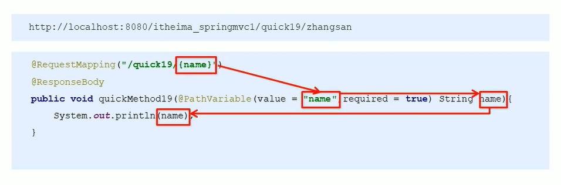
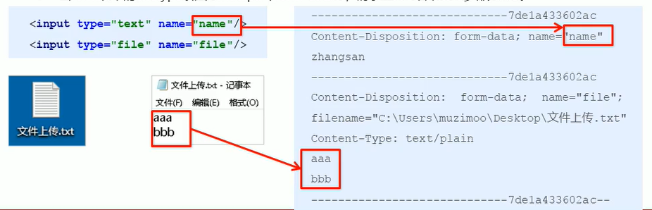
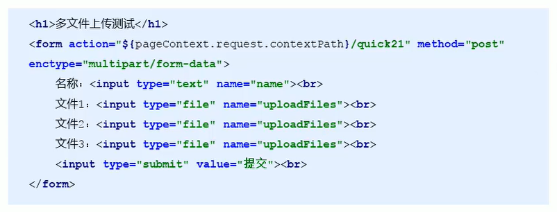
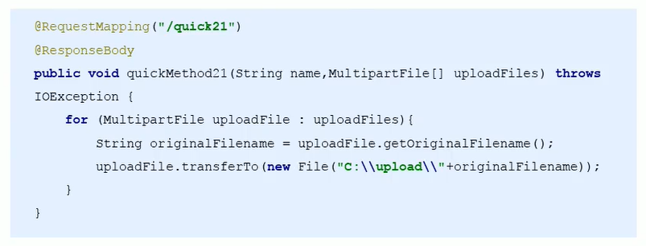

# SpringMVC 获取请求数据

## 获得请求参数

客户端请求参数的格式是: **name=value&name=value……**
服务器端要获得请求的参数，有时还需要进行数据的封装，SpringMVC可以接收如下类型的参数:

* 基本类型参数
* POJO类型参数
* 数组类型参数
* 集合类型参数

## 获得基本类型参数

Controller中的业务方法的参数名称要与请求参数的name一致，参数值会自动映射匹配。

```http
http://localhost:8080/spring_mvc/quick9?username=zhangsan&age=20
```

```java
@RequestMapping("/quick11")
@ResponseBody
public void save11(String username, Integer age) {
    System.out.println("username = " + username);
    System.out.println("age = " + age);
}
```

## 获得POJO类型参数

Controller中的业务方法的POJO参数的属性名与请求参数的name一致，参数值会自动映射匹配。

```http
http://localhost:8080/spring_mvc/quick10?username=zhangsan&age=20
```

```java
@RequestMapping("/quick12")
@ResponseBody
public void save12(User user) {
    System.out.println("user = " + user);
}
```

## 获得数组类型参数

Controller中的业务方法数组名称与请求参数的name一致，参数值会自动映射匹配。

```http
http://localhost:8080/spring_mvc/quick11?strs=111&strs=222&strs=333
```

```java
@RequestMapping("/quick13")
@ResponseBody
public void save13(String[] strs) {
    System.out.println("strs = " + Arrays.toString(strs));
}
```

## 获得集合类型参数

获得集合参数时，要将集合参数包装到一个POJO(VO)中才可以。

```java
public class VO {
    private List<User> userList;
}

@RequestMapping("/quick14")
@ResponseBody
public void save14(VO vo) {
    System.out.println("vo = " + vo);
}
```

```jsp
<form action="${pageContext.request.contextPath}/user/quick14" method="post">
    <input name="userList[0].username">
    <input name="userList[0].age" type="number">
    <br>
    <input name="userList[1].username">
    <input name="userList[1].age" type="number">
    <br>
    <input name="userList[2].username">
    <input name="userList[2].age" type="number">
    <br>
    <input type="submit" value="提交">
</form>
```

当使用ajax提交时，可以指定`contentType`为json形式，那么在方法参数位置使用**@RequestBody**可以直接接收集合数据而无需使用POJO进行包装。

```xml
<!--开放静态资源的访问-->
<mvc:resources mapping="/js/**" location="/js/"/>
```

```xml
<!--交给默认容器执行未找到的资源-->
<mvc:default-servlet-handler/>
```

```java
@RequestMapping("/quick15")
@ResponseBody
public void save15(@RequestBody List<User> userList) {
    System.out.println("userList = " + userList);
}
```

```jsp
<button id="button-id" type="button">提交</button>
<script src="${pageContext.request.contextPath}/js/jquery-3.4.1.min.js"></script>
<script>
    let userList = [];
    userList.push({
        username: "张山",
        age: 18,
    });
    userList.push({
        username: "李斯",
        age: 21,
    });
    userList.push({
        username: "王武",
        age: 19,
    });
    $("#button-id").on("click", function () {
        console.log(userList);
        $.ajax({
            url: "${pageContext.request.contextPath}/user/quick15",
            type: "POST",
            data: JSON.stringify(userList),
            contentType: "application/json;charset=utf-8",
        })
    })
</script>
```

## 请求乱码问题

当post请求时，数据会出现乱码，我们可以设置一个过滤器来进行编码的过滤。

```xml
<!--配置全局过滤 filter-->
<filter>
    <filter-name>CharacterEncodingFilter</filter-name>
    <filter-class>org.springframework.web.filter.CharacterEncodingFilter</filter-class>
    <init-param>
        <param-name>encoding</param-name>
        <param-value>UTF-8</param-value>
    </init-param>
</filter>
<filter-mapping>
    <filter-name>CharacterEncodingFilter</filter-name>
    <url-pattern>/*</url-pattern>
</filter-mapping>
```

## 参数绑定注解`@RequestParma`

当请求的参数名称与Controller的业务方法参数名称不一致时，就需要通过**@RequestParam**注解显示的绑定。

```java
@RequestMapping("/quick16")
@ResponseBody
public void save16(@RequestParam("name") String username) {
    System.out.println("username = " + username);
}
```

注解`@RequestParam`还有如下参数可以使用:

* `value`:与请求参数名称
* `required`此在指定的请求参数是否必须包括，默认是`true`，提交时如果没有此参数则报错
* `defaultValue`:当没有指定请求参数时，则使用指定的默认值赋值

```java
@RequestMapping("/quick16")
@ResponseBody
public void save16(@RequestParam(value = "name", required = false, defaultValue = "default user") String username) {
    System.out.println("username = " + username);
}
```

## 获取Restful风格的参数

**Restful**是一种软件**架构风格**、**设计风格**，而不是标准，只是提供了一组设计原则和约束条件。主要用于客户端和服务器交互类的软件，基于这个风格设计的软件可以更简洁，更有层次，更易于实现缓存机制等。

**Restful**风格的请求是使用“**url+请求方式**”表示一次请求目的的，HTTP协议里面四个表示操作方式的动词如下:

* `GET`: 用于获取资源
* `POST`: 用于新建资源
* `PUT`: 用于更新资源
* `DELETE`: 用于删除资源

例如:

* /user /1 GET :      得到id =1的user
* /user/1 DELETE: 删除 id =1的user
* /user/1 PUT:        更新 id =1的user
* /user    POST:     新增user

上述url地址/user/1中的1就是要获得的请求参数，在SpringMVC中可以使用占位符进行参数绑定。地址/user/1可以写成/user/{id}，占位符{id}对应的就是1的值。在业务方法中我们可以使用@PathVariable注解进行占位符的匹配获取工作。



```java
@RequestMapping("/quick17/{username}")
@ResponseBody
public void save17(@PathVariable(value = "username") String username) {
    System.out.println("username = " + username);
}
```

## 自定义类型转换器

SpringMVC默认已经提供了一些常用的类型转换器，例如客户端提交的字符串转换成`int`型进行参数设置。但是不是所有的数据类型都提供了转换器，没有提供的就需要自定义转换器，例如:**日期类型**的数据就需要自定义转换器。

自定义类型转换器的开发步骤：

1. 定义转换器类实现**Converter**接口

   ```java
   public class DateConverter implements Converter<String, Date> {
   
       @Override
       public Date convert(String source) {
           // 将日期字符串转换成日期对象并返回
           SimpleDateFormat format = new SimpleDateFormat("yyyy-MM-dd");
           Date date = null;
           try {
               date = format.parse(source);
           } catch (ParseException e) {
               e.printStackTrace();
           }
           return date;
       }
   }
   ```

2. 在配置文件里声明转换器

   ```xml
   <!--声明转换器-->
   <bean id="conversionService" class="org.springframework.context.support.ConversionServiceFactoryBean">
       <property name="converters">
           <set>
               <bean class="com.bright.converter.DateConverter"/>
           </set>
       </property>
   </bean>
   ```

3. 在`<annotation-driven>`中引用转换器

   ```xml
   <mvc:annotation-driven conversion-service="conversionService"/>
   ```

## 获得请求Servlet相关API

只需要在控制器的方法参数定义HttpServletRequest、HttpSession和HttpServletResponse对象。

```java
@RequestMapping("/quick19")
@ResponseBody
public void save19(HttpServletRequest request, HttpSession session, HttpServletResponse response) {
    System.out.println("request = " + request);
    System.out.println("response = " + response);
    System.out.println("session = " + session);
}
```

## 获得请求头信息

**@RequestHeader**

使用`@RequestHeader`可以获得请求头信息，相当于web阶段**request.getHeader(name)**

`@RequestHeader`注解的属性如下：

* `value`：请求头名称
* `required`：是否必须携带此请求头

```java
@RequestMapping("/quick20")
@ResponseBody
public void save20(@RequestHeader("User-Agent") String userAgent) {
    System.out.println("userAgent = " + userAgent);
}
```

**@CookieValue**

使用`@CookieValue`可以获得指定Cookie的值，注解属性如下：

* `value`：指定cookie名称
* `required`：是否必须携带此cookie

```java
@RequestMapping("/quick21")
@ResponseBody
public void save21(@CookieValue("JSESSIONID") String jSessionId) {
    System.out.println("jSessionId = " + jSessionId);
}
```

## 文件上传

### 文件上传客户端三要素

* 表单`type="file"`
* 表单的提交方式`post`
* 表单的`enctype`属性是多部分表单形式，及`enctype="multipart/form-data"`

### 文件上传原理

* 当form表单修改为多部分表单时，`request.getParameter()`将失效。
* 当`enctype="application/x-www-form-urlencoded"`时，form表单的正文内容格式是`key=value&key=value&key=value...`
* 当`enctype="multipart/form-data"`时，请求正文内容就变成多部分形式：



### 单文件上传

1. 导入`fileupload`和`io`坐标

   ```xml
   <dependency>
       <groupId>commons-fileupload</groupId>
       <artifactId>commons-fileupload</artifactId>
       <version>1.4</version>
   </dependency>
   ```

2. 配置文件上传解析器

   ```xml
   <!--配置文件上传解析器-->
   <bean class="org.springframework.web.multipart.commons.CommonsMultipartResolver">
       <!--上传文件总大小-->
       <property name="maxUploadSize" value="5242800"/>
       <!--上传单个文件大小-->
       <property name="maxUploadSizePerFile" value="5242800"/>
       <!--文件默认编码-->
       <property name="defaultEncoding" value="UTF-8"/>
   </bean>
   ```

3. 编写文件上传代码

   ```java
   @RequestMapping("/quick22")
   @ResponseBody
   public void save22(String username, MultipartFile upload) throws IOException {
       System.out.println("username = " + username);
       // 获取文件名称
       String filename = upload.getOriginalFilename();
       // 保存文件
       upload.transferTo(new File("D:\\temp\\" + filename));
   }
   ```

### 多文件上传

可以使用多个不同参数的方法，

也可以使用数组的形式传递，只需要将页面修改为多个文件上传项，将方法参数`MultipartFile`类型修改为`MultipartFile[]`即可。





