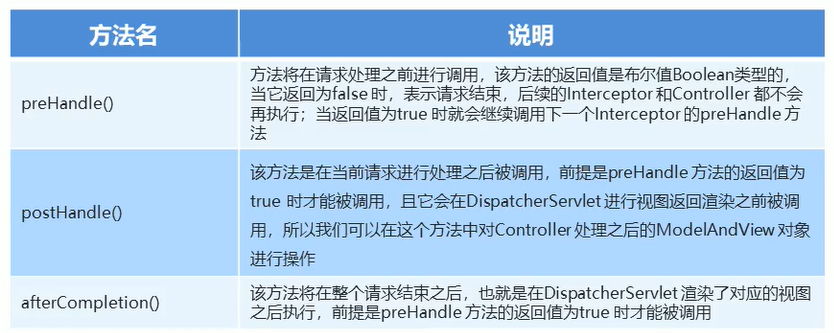

# SpringMVC 拦截器

### 拦截器（interceptor）的作用

Spring MVC的**拦截器**类似于Servlet开发中的过滤器Filter，用于对处理器进行**预处理**和**后处理**。

将拦截器按一定的顺序联结成一条链，这条链称为**拦截器链**(**Interceptor Chain**)。在访问被拦截的方法或字段时，拦截器链中的拦截器就会按其之前定义的顺序被调用。拦截器也是AOP思想的具体实现。

### 拦截器和过滤器的区别

|   区别   |                         过滤器                         |                            拦截器                            |
| :------: | :----------------------------------------------------: | :----------------------------------------------------------: |
| 使用范围 |  是servlet规范中的一部分，任何Java Web工程都可以使用   |  是SpringMVC框架自己的，只有使用了SpringMVC框架的工程才能用  |
| 拦截范围 | 在url-pattern中配置了/*之后,可以对所有要访问的资源拦截 | 只会拦截访问的控制器方法，如果访问的是jsp,html,css,image或者js是不会进行拦截的 |

### 拦截器快速入门

自定义拦截器很简单，只有如下三步：

1. 创建拦截器类实现`HandlerInterceptor`接口

   ```java
   public class MyInterceptor implements HandlerInterceptor {
       /**
        * 目标方法执行之前执行
        *
        * @return bool ture: 放行; false: 不放行
        */
       @Override
       public boolean preHandle(HttpServletRequest request, HttpServletResponse response, Object handler) throws ServletException, IOException {
           System.out.println("preHandle...");
           String param = request.getParameter("param");
           if ("yes".equals(param)) {
               System.out.println("放行");
               return true;
           }
           request.getRequestDispatcher("error.jsp").forward(request, response);
           return false;
       }
   
       /**
        * 目标方法执行之后，视图对象返回之前执行
        */
       @Override
       public void postHandle(HttpServletRequest request, HttpServletResponse response, Object handler, ModelAndView modelAndView) {
           modelAndView.addObject("name", "Cat");
           System.out.println("postHandle...");
       }
   
       /**
        * 在流程执行完毕之后执行
        */
       @Override
       public void afterCompletion(HttpServletRequest request, HttpServletResponse response, Object handler, Exception ex) {
           System.out.println("afterCompletion...");
       }
   }
   ```

2. 配置拦截器

   ```xml
   <!--配置拦截器-->
   <mvc:interceptors>
       <mvc:interceptor>
           <!--对哪些资源进行拦截操作-->
           <mvc:mapping path="/**"/>
           <!--对哪些资源排除拦截操作-->
           <mvc:exclude-mapping path="/login"/>
           <bean class="com.bright.interceptor.MyInterceptor"/>
       </mvc:interceptor>
   </mvc:interceptors>
   ```

3. 测试拦截器的效果

### 拦截器方法说明




