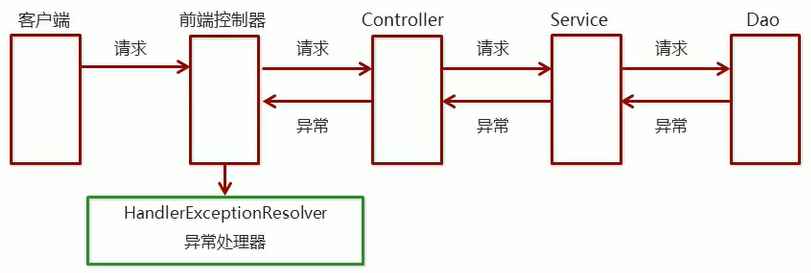
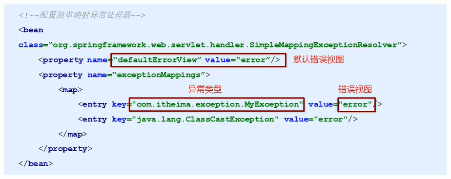

# SpringMVC 异常处理机制

## 异常处理思路

系统中异常包括两类:**预期异常**和**运行时异常RuntimeException**，前者通过捕获异常从而获取异常信息，后者主要通过规范代码开发、测试等手段减少运行时异常的发生。

系统的**Dao**、**Service**、**Controller**出现都通过throws Exception向上抛出，最后由SpringMVC前端控制器交由异常处理器进行异常处理，如下图:



## 异常处理两种方式

* 使用Spring MVC提供的简单异常处理器`SimpleMappingExceptionResolver`
* 实现Spring的异常处理接口`HandlerExceptionResolver`自定义自己的异常处理器

### 简单异常处理器SimpleMappingExceptionResolver

SpringMVC已经定义好了该类型转换器，在使用时可以根据项目情况进行相应异常与视图的映射配置



### 自定义异常处理器步骤

1. 创建异常处理器类实现`HandlerExceptionResolver`接口

   ```java
   public class MyExceptionResolver implements HandlerExceptionResolver {
       /**
        * @param ex Exception 异常对象
        * @return ModelAndView 跳转到错误异常信息页面
        */
       @Override
       public ModelAndView resolveException(HttpServletRequest request, HttpServletResponse response, Object handler, Exception ex) {
   
           ModelAndView modelAndView = new ModelAndView();
           if (ex instanceof MyException) {
               modelAndView.addObject("info", "自定义异常");
           } else if (ex instanceof ClassCastException) {
               modelAndView.addObject("info", "类型转换异常");
           } else {
               modelAndView.addObject("info", "其他异常");
           }
   
           modelAndView.setViewName("error4");
           return modelAndView;
       }
   }
   ```

2. 配置异常处理器

   ```xml
   <!--配置自定义异常处理器-->
   <bean class="com.bright.resolver.MyExceptionResolver"/>
   ```

3. 编写异常页面

4. 测试异常跳转


