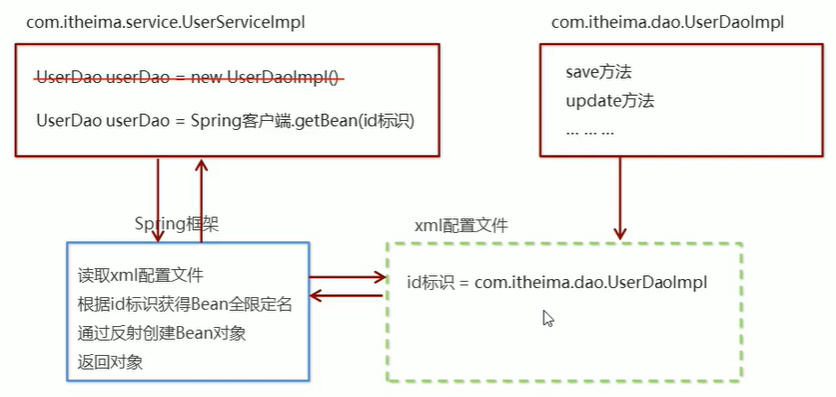

# Spring 快速入门

## Spring 程序开发步骤

① 导入Spring开发的基本包坐标

② 编写Dao接口和实现类

③ 创建Spring核心配置文件

④ 在Spring配置文件中配置UserDaoImpl

⑤ 使用Spring的API获得Bean实例

**具体步骤**

① 导入坐标

② 创建`Bean`

③ 创建`applicationContext.xml`配置文件

④ 在配置文件中进行配置

⑤ 创建`ApplicationContext`对象，通过`getBean`方法获取实例

