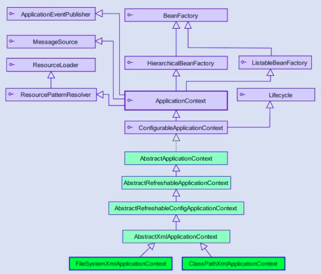
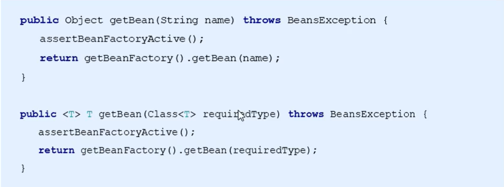

# Spring相关API

## ApplicationContext 的继承体系

**ApplicationContext**：接口类型，代表应用上下文，可以通过其实例获得Spring容器中的Bean对象



## ApplicationContext的实现类

**1）ClassPathXmlApplicationContext**

它是从类的根路径下加载配置文件，推荐使用这种

```java
ApplicationContext app = new ClassPathXmlApplicationContext("applicationContext.xml");
```

**2）FileSystemXmlApplicationContext**

从文件系统中加载配置文件，配置文件可以在磁盘的任意位置

```java
ApplicationContext app = new FileSystemXmlApplicationContext("D:\\IdeaProjects\\SpringStudyFromITHeiMA\\SpringIoC\\src\\main\\resources\\applicationContext.xml");
```

**3）AnnotationConfigApplicationContext**

当使用注解配置容器对象时，需要使用此类来创建Spring容器。它用来读取注解。

## getBean()方法使用



```java
// 通过容器中的id获取对象，可以有多个相同数据类型的对象
UserService userService = (UserService) app.getBean("userService");
```

```java
// 通过数据类型获取容器中的对象，容器中只能有一个相同的数据类型的对象
UserService userService = app.getBean(UserService.class);
```

