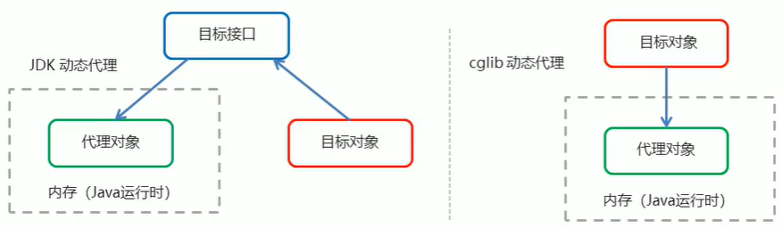

# Spring 的 AOP 简介

## 什么是 AOP

**AOP**（Aspect Oriented Programming，**面向切面编程**），是通过预编译方式和运行期动态代理实现程序功能的统一维护的一种技术。

AOP是OOP的延续，是软件开发中的一个热点，也是Spring框架中的一个重要内容，是函数式编程的一种衍生范型。利用AOP可以对业务逻辑的各个部分进行隔离，从而使得业务逻辑各部分之间的耦合度降低，提高程序的可重用性，同时提高了开发的效率。

## AOP的作用及其优势

* 作用：在程序运行期间，在不修改源代码的情况下，对方法进行功能增强
* 优势：减少重复代码，提高开发效率，并且便于维护。

## AOP的底层实现

实际上，AOP的底层是通过Spring提供的的动态代理技术实现的。在运行期间，Spring通过动态代理技术动态的生成代理对象，代理对象方法执行时进行增强功能的介入，在去调用目标对象的方法，从而完成功能的增强。

## AOP的动态代理技术

常用的动态代理技术

* JDK代理：基于接口的动态代理技术
* cglib代理：基于父类的动态代理技术



## JDK 的动态代理

```java
// 创建目标对象
final Target target = new Target();
// 增强对象
Advice advice = new Advice();
// 放回值就是动态生成的代理对象
TargetInterface proxy = (TargetInterface) Proxy.newProxyInstance(
        // 目标对象的类加载器
        target.getClass().getClassLoader(),
        // 目标对象相同的接口字节码对象数组
        target.getClass().getInterfaces(),
        new InvocationHandler() {
            // 调用代理对象的任何方法 实质执行的都是 invoke 方法
            @Override
            public Object invoke(Object proxy, Method method, Object[] args) throws Throwable {
                // 前置增强
                advice.before();
                // 执行目标方法
                Object invoke = method.invoke(target, args);
                // 后置增强
                advice.afterRunning();

                return invoke;
            }
        }
);

// 调用代理对象的方法
proxy.save();
```

## cglib 的动态代理

```java
// 目标对象
Target target = new Target();
// 增强对象
Advice advice = new Advice();

// 返回值就是动态生成的代理对象 基于 cglib
// 1. 创建增强器
Enhancer enhancer = new Enhancer();
// 2. 设置父类（目标）
enhancer.setSuperclass(Target.class);
// 3. 设置回调
enhancer.setCallback(new MethodInterceptor() {
    @Override
    public Object intercept(Object o, Method method, Object[] objects, MethodProxy methodProxy) throws Throwable {
        // 执行前置
        advice.before();
        // 执行目标
        Object invoke = method.invoke(target, objects);
        // 执行后置
        advice.afterRunning();
        return invoke;
    }
});
// 4. 创建代理对象
Target proxy = (Target) enhancer.create();
proxy.save();
```

## AOP相关概念

Spring的AOP实现底层就是对上面的动态代理的代码进行了封装，封装后我们只需要对需要关注的部分进行代码编写，并通过配置的方式完成指定目标的方法增强。

在正式讲解AOP的操作之前，我们必须理解AOP的相关术语，常用的术语如下：

* Target（目标对象）：代理的目标对象
* Proxy（代理）：个类被AOP织入增强后，就产生一个结果代理类
* Joinpoint（连接点）︰所谓连接点是指那些被拦截到的点。在spring中，这些点指的是方法，因为spring只支持方法类型的连接点
* Pointcut（切入点）：所谓切入点是指我们要对哪些Joinpoint进行拦截的定义
* Advice（通知/增强）：所谓通知是指拦截到Joinpoint之后所要做的事情就是通知
* Aspect（切面）：是切入点和通知(引介)的结合
* Weaving（织入）：是指把增强应用到目标对象来创建新的代理对象的过程。spring采用动态代理织入，而AspectJ采用编译期织入和类装载期织入

## AOP 开发明确的事项

### 1. 需要编写的内容

* 编写核心业务代码（目标类的目标方法）
* 编写切面类，切面类中有通知（增强功能方法）
* 在配置文件中，配置织入关系，即将哪些通知与哪些连接点进行结合

### 2. AOP技术实现的内容

Spring框架监控切入点方法的执行。一旦监控到切入点方法被执行，使用代理机制，动态创建目标对象的代理对象，根据通知类型，在代理对象的对应位置，将通知对应的功能织入，完成完整的代码逻辑运行。

### 3. AOP底层使用哪种代理方式

在Spring中，框架会根据目标类是否实现类接口来决定采用哪种动态代理的方式。

## AOP知识要点

* AOP：面向切面编程
* AOP底层实现：基于JDK的动态代理和基于cglib的动态代理
* AOP的重点概念：
  * Pointcut（切点）：被增强的方法
  * Advice（通知/增强）：封装增强业务逻辑的方法
  * Aspect（切面）：切点+通知
  * Weaving（织入）：将切点与通知结合的过程
* 开发明确事项：
  * 谁是切点（切点表达式配置）
  * 谁是通知（切面类中的增强方法）
  * 将切点和通知进行织入配置

